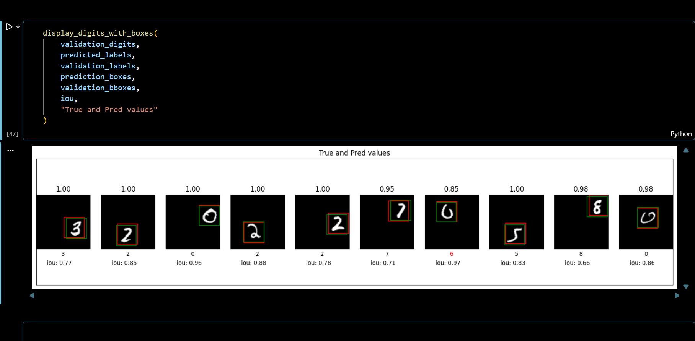

# Object Classification (AI Project)

## Overview
This project focuses on object classification using deep learning techniques. It uses TensorFlow/Keras to train a model that can classify images into different categories.

## Technologies Used
- Python
- TensorFlow
- Keras
- NumPy / Pandas

## Features
- Image preprocessing
- Model training and evaluation
- Object classification

## How it Works
The model is trained on labeled image data. After preprocessing, it learns patterns and predicts categories for new images.

## Project File
- Object Classification.ipynb

## Screenshot

## Author
Procheta Ray
